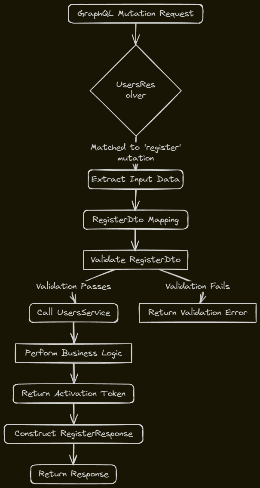

## 1. User Entity (`user.entity.ts`)
1. **user.entity.ts**

```typescript
import { ObjectType, Field } from '@nestjs/graphql';

@ObjectType()
export class User {
  @Field()
  id: string;

  @Field()
  name: string;

  @Field()
  email: string;

  // ... other properties
}
```

In this example, we define a `User` class marked with `@ObjectType()`. The `@Field()` decorator is used to expose the `id`, `name`, and `email` properties as fields of the GraphQL Object Type.
In `user.entity.ts`, you define the `User` and `Avatars` classes using decorators from `@nestjs/graphql`.

- `@ObjectType()`: This decorator is used to mark a class as a GraphQL object type. An object type is a type you can define fields on, and these fields can return other types.

- `@Field()`: This decorator is used to mark a property in your TypeScript class as a field of the GraphQL object type. The field can return scalars like `String`, `Boolean`, `Int`, etc., or other object types.

- `@Directive()`:This is a GraphQL directive that specifies the unique key for the Avatars type. It allows you to specify which field(s) should be used as the unique identifier for objects of this type.. In your case, `@key(fields:"id")` is used to specify that the `id` field is the key for the `Avatars` object type.
- The `@nestjs/graphql` package provides several other decorators and utilities for working with GraphQL in NestJS, such as `@Args()`, `@Query()`, `@Mutation()`, and more.

## 2. Data Transfer Object (DTO) (`dto`)

In GraphQL, you use the `@InputType()` decorator to define an input type, which is a special kind of object type that can be passed as an argument. Here, `RegisterDto` is an input type.

- `@Field()`: This decorator is used to define a field in the input type. The field can be of any scalar or enum type.

## 3. User Resolver (`user.mutation.ts`)
```typescript
import { Resolver, Mutation, Args } from '@nestjs/graphql';
import { UsersService } from './users.service';
import { RegisterDto } from './dto/user.dto';
import { RegisterResponse } from './types/user.types';

@Resolver('User')
export class UsersResolver {
  constructor(private usersService: UsersService) {}

  @Mutation(() => RegisterResponse)
  async register(
    @Args('registerDto') registerDto: RegisterDto,
  ): Promise<RegisterResponse> {
    const activationToken = await this.usersService.register(registerDto);
    return { activationToken };
  }
}
```
The resolver is responsible for resolving the data for the fields on your object types. In your case, `UsersResolver` is the resolver for the `User` object type.

- `@Resolver('User')`: This decorator is used to mark a class as a GraphQL Resolver, which handles the implementation of GraphQL queries, mutations, and subscriptions.

- `@Mutation()`: This decorator is used to define a mutation in your GraphQL API. Mutations are used when you want to create, update, or delete data.

- `register()`: This method is a mutation that takes `registerDto` as an argument and returns a `Promise<RegisterResponse>`. It uses the `UsersService` to register a user and returns the activation token.

Here's a simplified flow of how these parts work together:



1. The GraphQL mutation request is received by the NestJS server and matched to the `register` mutation in the `UsersResolver`.
2. The `register` mutation extracts the input data from the request using the `@Args()` decorator and maps it to the `RegisterDto` object.
3. The `RegisterDto` object is validated using the validation rules defined in the DTO class (e.g., `@IsNotEmpty()`, `@IsString()`, etc.).
4. If the validation passes, the `register` method of the `UsersService` is called with the validated input data and the response object from the context.
5. The `UsersService` performs the necessary business logic for user registration (e.g., hashing the password, creating a new user record in the database, generating an activation token, etc.).
6. The `UsersService` returns the activation token or any other relevant data to the `UsersResolver`.
7. The `UsersResolver` constructs the `RegisterResponse` object with the activation token and returns it as the response to the GraphQL mutation request.

The client application can then handle the response from the GraphQL mutation as needed (e.g., displaying a success message, redirecting to an activation page, etc.).

To see an example with JSON data, let's assume the client sends the following GraphQL mutation:

```graphql
mutation RegisterUser($input: RegisterDto!) {
  register(registerDto: $input) {
    activation_token
    error {
      message
      code
    }
  }
}
```

With the following variables:

```json
{
  "input": {
    "name": "John Doe",
    "email": "john@example.com",
    "password": "password123",
    "phone_number": 1234567890
  }
}
```

The server might respond with:

```json
{
  "data": {
    "register": {
      "activation_token": "abc123xyz",
      "error": null
    }
  }
}
```


